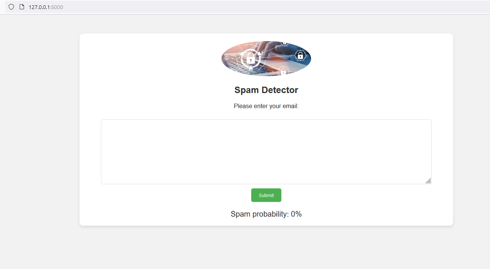

# SPAM CLASSIFIER APP

The objective of this project is to train a spam classifier using the [Apache SpamAssassin public data](https://spamassassin.apache.org/old/publiccorpus/) and then use this model to create an app with Flask where the user inputs an email and the app outputs the probability of that email being spam. 

## Steps
- Download and understand the data format
- Split the data into train and test set
- Process and prepare the data:
  - Remove email headers
  - Handle HTML content
  - Lowercase the email body
  - Remove special characters and punctuation
  - Tokenization
  - Count Vectorizer
- Train and evaluate a few classification models(SGD, SVM, Decision Tree, Random Forest) on recall, precision and ROC.
- Fine-tune the best classifiers (SGD, Random forest, SVM)
- Evaluate on the test set and keep the best model, the Random Forest, which has:
  - Precision: 0.961
  - Recall: 0.964
  - F1-score: 0.962
  - Accuracy: 0.966
- Create the front-end of the app with HTML and CSS for styling. It has a submit button to send the email.
- Create the back-end of the app with the Flask framework.
- Deploy the app to the cloud using Heroku (optional). 
  

## Other information
If you want to run the project, this information may be useful:
- Spam classifier.ipynb is the jupyter notebook used to process the data, train and evaluate the models. It contains a path to download and access the datasets from Apache SpamAssassin.
- Spam_classifier2.py contains the processing functions, custom transformer, and pipeline from the jupyter notebook as a .py file. It is used to import the pipeline in app.py and process the input emails from the user.
- RandomForest_best.joblib : Chosen model to deploy that was dowloaded in the jupyter notebook.
- app.py : contains the backend of the app
- static folder: Some images for the front-end
- templates: HTML code for the front-end

## Results 
Below you can see the final result. You can click to the image to see a video demonstration.

